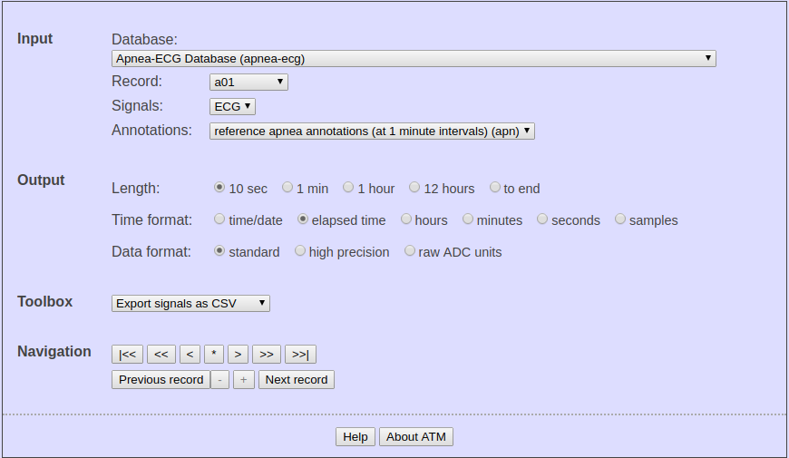
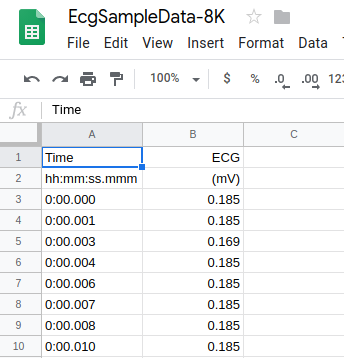

# Visualise electrocardiogram (ECG) data using Google Sheets & Plotly for JavaScript.

With more & more data being deployed into the cloud, there is a need to be able to fetch / stream the data directly from the cloud into end users' device(s). This project is a minimal application that fetches sample ECG data (in csv format) from a publicly shared google sheet, parses the fields and plots into a browser window using Plotly.js

## Getting Started

These instructions will get you a copy of the project up and running on your local machine for development and testing purposes. See deployment for notes on how to deploy the project on a live system.

* Clone the project: https://github.com/sshesh/sliding-chart.git

### Prerequisites

1. A code editor (such as Visual Studio Code in this case. VSC provides a "live-server" plugin, a handy tool for testing.)
2. A browser (Google Chrome browser in this case).
3. A Google Sheet (comes as part of GSuite Apps) where ECG data may be stored and retrieved as a CSV file.

### Installing

To install Visual Studio Code on your platform, please follow instructions detailed under https://code.visualstudio.com/docs/setup/setup-overview

## How to get ECG samples and use in google sheets?

1. From website - https://physionet.org/cgi-bin/atm/ATM, make suitable selections in the tool. Data samples are generated at the bottom of the page.

<br></img>
<br>

2. Save the CSV file onto your computer.
<br>

3. Open Google Sheets & import the csv file from previous step.
<br></img>
<br>

4. From Google Sheets main menu, choose File -> "Publish to web" option & copy the link into your script code.

```
const uri = ("https://docs.google.com/spreadsheets/d/e/2PACX-1vRhJSg7JV5W_LALesi4F20AWr6cCev99mr12Zh9j6At3TDJWGqYf4qsblAvLYPbugcnK0FOJ_WMnWRV/pub?gid=2093731892&single=true&output=csv");

```
### How to test?

<br></img>
<br>
* Click on "Go-Live" if you're using Visual Studio Code with the plugin installed.

### Sample Output

<br>
<br>

### Coding style tests

TBD

## Deployment

TBD

## Built & Tested With/On

* Ubuntu 14.04 LTS
* Microsoft Visual Studio Code version 1.34.0
* GSuite (for Google Sheets App)
* Google Chrome version 74.0.3729

## Troubleshooting

### Problem: I notice following error in the browser console
*Access to XMLHttpRequest at 'https://docs.google.com...&output=csv' from origin 'null' has been blocked by CORS policy: No 'Access-Control-Allow-Origin' header is present on the requested resource.

### Solution 1:
Please check SO @ https://stackoverflow.com/questions/20035101/why-does-my-javascript-get-a-no-access-control-allow-origin-header-is-present?rq=1

## Contributing

Please read [CONTRIBUTING.md](https://gist.github.com/PurpleBooth/b24679402957c63ec426) for details on our code of conduct, and the process for submitting pull requests to us.

## Versioning

We use [SemVer](http://semver.org/) for versioning. For the versions available, see the [tags on this repository](https://github.com/your/project/tags). 

## Authors

* **Subramanya Sheshadri** - *Initial work*

See also the list of [CONTRIBUTORS.md](CONTRIBUTORS.md) who participated in this project.

## License

This project is licensed under the MIT License - see the [LICENSE.md](LICENSE.md) file for details

## Acknowledgments

* This README Template: https://gist.github.com/PurpleBooth/109311bb0361f32d87a2#file-readme-template-md
